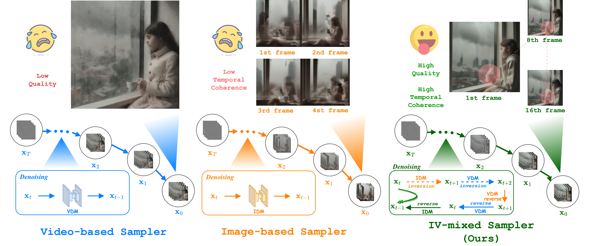
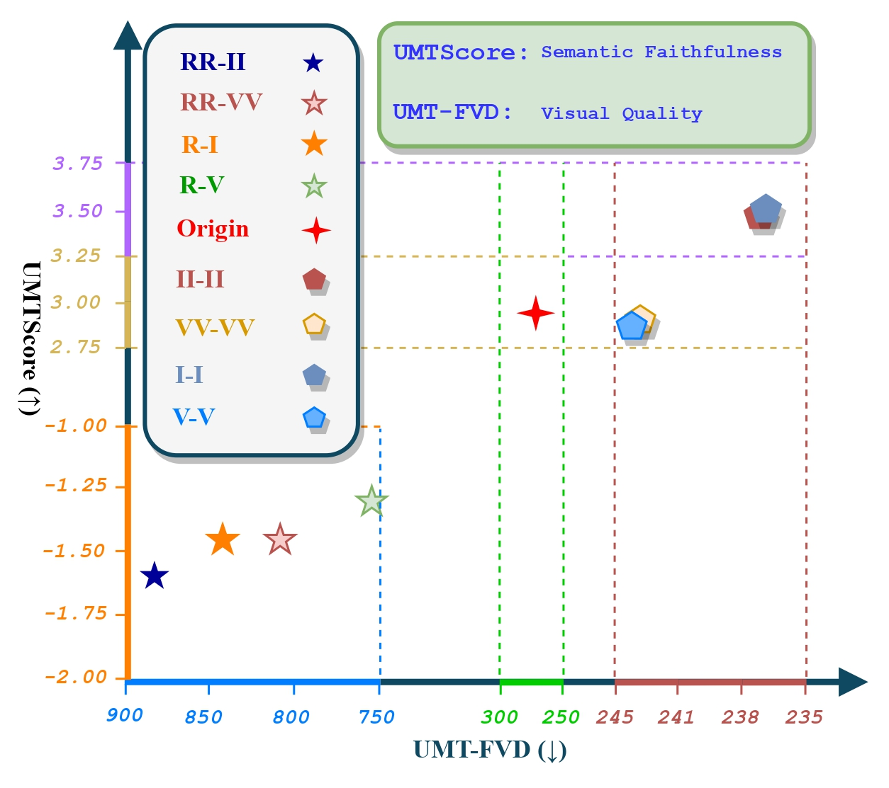
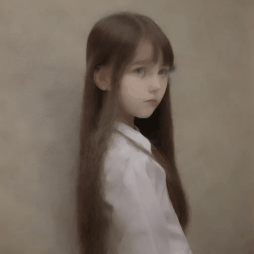
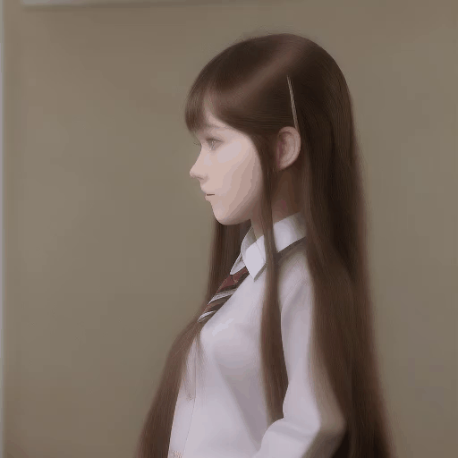
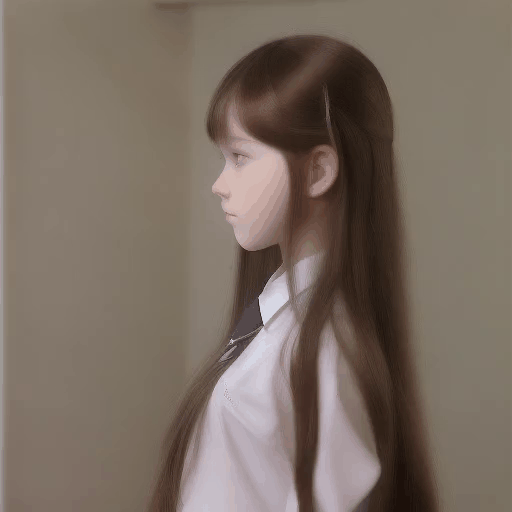
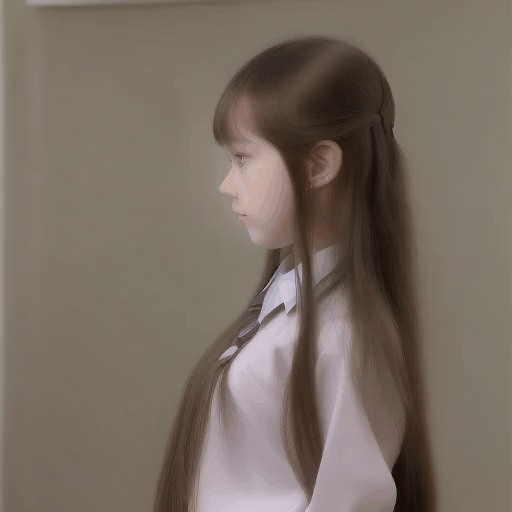

# _IV-mixed Sampler_

Offical Implementation of our research:

> [IV-Mixed Sampler: Leveraging Image Diffusion Models for Enhanced Video Synthesis](https://arxiv.org/abs/2410.04171) [CIRL 2025 🚀]  <br>

Authors:

><em>Shitong Shao, Zikai Zhou, Lichen Bai, Haoyi Xiong, </em> and <em>Zeke Xie*</em> <br>
> HKUST (Guangzhou) and Baidu Inc. <br>
> *: Corresponding author


<div align=left>

</div>

Abstract:

> **The multi-step sampling mechanism, a key feature of visual diffusion models, has significant potential to replicate the success of OpenAI's Strawberry in enhancing performance by increasing the inference computational cost. Sufficient prior studies have demonstrated that correctly scaling up computation in the sampling process can successfully lead to improved generation quality, enhanced image editing, and compositional generalization. While there have been rapid advancements in developing inference-heavy algorithms for improved image generation, relatively little work has explored inference scaling laws in video diffusion models (VDMs). Furthermore, existing research shows only minimal performance gains that are perceptible to the naked eye. To address this, we design a novel training-free algorithm IV-Mixed Sampler that leverages the strengths of image diffusion models (IDMs) to assist VDMs surpass their current capabilities. The core of IV-Mixed Sampler is to use IDMs to significantly enhance the quality of each video frame and VDMs ensure the temporal coherence of the video during the sampling process. Our experiments have demonstrated that IV-Mixed Sampler achieves state-of-the-art performance on 4 benchmarks including UCF-101-FVD, MSR-VTT-FVD, Chronomagic-Bench-150, and Chronomagic-Bench-1649. For example, the open-source Animatediff with IV-Mixed Sampler reduces the UMT-FVD score from 275.2 to 228.6, closing to 223.1 from the closed-source Pika-2.0.**


Motivation:

<div align=left>

</div>


UMTScore (↑) vs. UMT-FVD (↓) with Animatediff on Chronomagic-Bench-150. In the legend, "R", "I", and "V" represent the score function estimation using random Gaussian noise, IDM, and VDM, respectively. Moreover, the front of the horizontal line "-" refers to the additive noise form, while the back of "-" represents the denoising paradigm. For instance, "RR-II" stands for a two-step of adding noise with Guassian noise followed by two-step of denoising performed using IDM.

We enhance the quality of each frame at every denoising step by performing the following additional operation: 1) first adding Gaussian noise and 2) then denoising using IDMs. Unfortunately, as illustrated in the above figure, the approach "R-[.]", which use Gaussian noise to perform the forward diffusion process, result in significantly lower quality of the synthesized video compared to the standard DDIM process (i.e., Origin in the above figure). This phenomenon arises because "R-[.]" over-introduces invalid information (i.e., Gaussian noise) into the synthesized video during denoising. Given this, we consider the more robust _deterministic sampling_ method to integrate the video denoising process with the image denoising process, as this paradigm is stable and effectively reduces truncation errors in practical discrete sampling.

## Requirements

* All experiments are conducted on a single RTX 4090 GPU (24 GB).

## Get_started

Install the dependencies:

```bash
conda create -n ivs python=3.10.14
conda activate ivs
pip install torch==2.4.0 torchvision==0.19.0 torchaudio==2.4.0 --index-url https://download.pytorch.org/whl/cu121
pip install diffusers transformers einops wandb accelerate pandas imageio imageio-ffmpeg
```

Run the following command to generate the video.
```bash
python inference.py --prompt "a beautiful girl" --pipeline Animatediff # pipeline: Animatediff, ModelScope, VideoCrafter
```

## Important Notes

- The hyperparameters `--interval_begin` and `--interval_end` are used to specify the start and end timesteps for the video generation.
- The hyperparameters `--zz` used to control the balance between the temporal coherence and the visual quality of synthesized video. If `--zz` is more large, the video generation process will pay more attention to the temporal coherence, otherwise, the video generation process will pay more attention to the visual quality.
- The hyperparameters `--i_sigma_begin` and `--i_sigma_end` are used to specify the start and end CFG scale for the image diffusion model. And `--v_sigma_begin` and `--v_sigma_end` are used to specify the start and end CFG scale for the video diffusion model. `--rho` controls the concave and convex properties of the curve
- The hyperparameters `--lora` is only used in `Animatediff` pipeline. The choice of `--lora` is `None`, `amechass` or `beauty`. You can choose the lora model to introduce desirable semantic information into the video generation process.

### Download Lora

Currently all the lora is placed in the `lora` folder, you need to convert it to diffusers mode via script `./lora/convert_lora_safetensor_to_diffusers.py`. Such as

```bash
python ./lora/convert_lora_safetensor_to_diffusers.py --lora_path --checkpoint_path "./lora/amechass.safetensors" --dump_path "./lora/amechass/" --base_model_path "/path/to/stable-diffusion-v1-5"
```

## Visualization


1. Baseline Model with 512x512 resolution:

<table style="width: 100%; border-collapse: collapse; font-family: Arial, sans-serif; font-size: 14px; text-align: center;">
        <thead style="background-color: #f2f2f2; border-bottom: 2px solid #ddd;">
            <!-- <tr>
                <th style="padding: 10px;">AnimateDiff (Standard)</th>
                <th style="padding: 10px;">AnimateDiff (IV-mixed Sampler)</th>
                <th style="padding: 10px;">VideoCrafter (Standard)</th>
                <th style="padding: 10px;">VideoCrafter (IV-mixed Sampler)</th>
            </tr> -->
        </thead>
        <tbody>
            <tr>
                <td></td>
                <td></td>
                <td></td>
                <td></td>
            </tr>
            <tr style="border-bottom: 1px solid #ddd;">
                <td style="padding: 2px 10px;">"Two horses race across a grassy field at sunset"</td>
                <td style="padding: 2px 10px;">"Two horses race across a grassy field at sunset"</td>
                <td style="padding: 2px 10px;">"Two horses race across a grassy field at sunset"</td>
                <td style="padding: 2px 10px;">"Two horses race across a grassy field at sunset"</td>
            </tr>
            <tr>
                <th style="padding: 10px;">AnimateDiff (Standard)</th>
                <th style="padding: 10px;">AnimateDiff (IV-mixed Sampler)</th>
                <th style="padding: 10px;">VideoCrafter (Standard)</th>
                <th style="padding: 10px;">VideoCrafter (IV-mixed Sampler)</th>
            </tr>
            <tr>
                <td></td>
                <td></td>
                <td></td>
                <td></td>
            </tr>
            <tr style="border-bottom: 1px solid #ddd;">
                <td style="padding: 2px 10px;">"Two horses race across a grassy field at sunset"</td>
                <td style="padding: 2px 10px;">"Two horses race across a grassy field at sunset"</td>
                <td style="padding: 2px 10px;">"A snowy mountain peak, a lone skier carving through powder"</td>
                <td style="padding: 2px 10px;">"A snowy mountain peak, a lone skier carving through powder"</td>
            </tr>
            <tr>
                <th style="padding: 10px;">ModelScope (Standard)</th>
                <th style="padding: 10px;">ModelScope (IV-mixed Sampler)</th>
                <th style="padding: 10px;">AnimateDiff (Standard)</th>
                <th style="padding: 10px;">AnimateDiff (IV-mixed Sampler)</th>
            </tr>
            <tr>
                <td></td>
                <td></td>
                <td></td>
                <td></td>
            </tr>
            <tr style="border-bottom: 1px solid #ddd;">
                <td style="padding: 2px 10px;">"A snowy mountain peak, a lone skier carving through powder"</td>
                <td style="padding: 2px 10px;">"A snowy mountain peak, a lone skier carving through powder"</td>
                <td style="padding: 2px 10px;">"A snowy mountain peak, a lone skier carving through powder"</td>
                <td style="padding: 2px 10px;">"A snowy mountain peak, a lone skier carving through powder"</td>
            </tr>
            <tr>
                <th style="padding: 10px;">VideoCrafter (Standard)</th>
                <th style="padding: 10px;">VideoCrafter (IV-mixed Sampler)</th>
                <th style="padding: 10px;">ModelScope (Standard)</th>
                <th style="padding: 10px;">ModelScope (IV-mixed Sampler)</th>
            </tr>
   </tbody>
</table>


2. LoRA in Animatediff, sourced from [AmechaSSS](https://civitai.com/models/15464/a-mecha-musume-a) and [Beauty](https://civitai.com/models/53601/nwsjrealistic?modelVersionId=89527):

<table style="width: 100%; border-collapse: collapse; font-family: Arial, sans-serif; font-size: 14px; text-align: center;">
        <thead style="background-color: #f2f2f2; border-bottom: 2px solid #ddd;">
            <tr>
                <th style="padding: 10px;">Standard</th>
                <th style="padding: 10px;">IV-mixed Sampler (vanilla)</th>
                <th style="padding: 10px;">IV-mixed Sampler (amechass)</th>
                <th style="padding: 10px;">IV-mixed Sampler (beauty)</th>
            </tr>
        </thead>
        <tbody>
            <tr>
                <td></td>
                <td></td>
                <td></td>
                <td></td>
            </tr>
            <tr style="border-bottom: 1px solid #ddd;">
                <td style="padding: 2px 10px;">"masterpiece, best quality,realistic,(realskin:1.5),1girl,school,longhair,no_bangs, side_view,looking at viewer,school uniform,realskin, softlight"</td>
                <td style="padding: 2px 10px;">"masterpiece, best quality,realistic,(realskin:1.5),1girl,school,longhair,no_bangs, side_view,looking at viewer,school uniform,realskin, softlight"</td>
                <td style="padding: 2px 10px;">"masterpiece, best quality,realistic,(realskin:1.5),1girl,school,longhair,no_bangs, side_view,looking at viewer,school uniform,realskin, softlight"</td>
                <td style="padding: 2px 10px;">"masterpiece, best quality,realistic,(realskin:1.5),1girl,school,longhair,no_bangs, side_view,looking at viewer,school uniform,realskin, softlight"</td>
            </tr>
   </tbody>
</table>


## Citation

```bibtex
@inproceedings{
shao2025ivmixed,
title={{IV}-mixed Sampler: Leveraging Image Diffusion Models for Enhanced Video Synthesis},
author={Shitong Shao and zikai zhou and Bai LiChen and Haoyi Xiong and Zeke Xie},
booktitle={The Thirteenth International Conference on Learning Representations},
year={2025},
url={https://openreview.net/forum?id=ImpeMDJfVL}
}
```

## Acknowledgments

The code is built upon [ViCo](https://github.com/Adamdad/vico) and [diffusers](https://github.com/huggingface/diffusers). We thank the valuable code from the above repositories.

